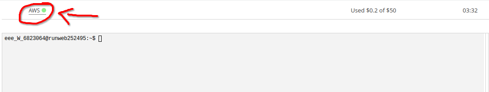
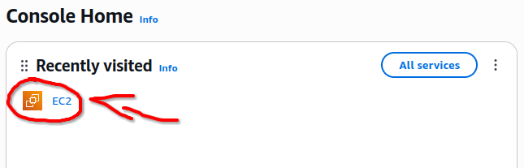
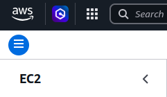
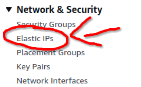
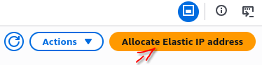
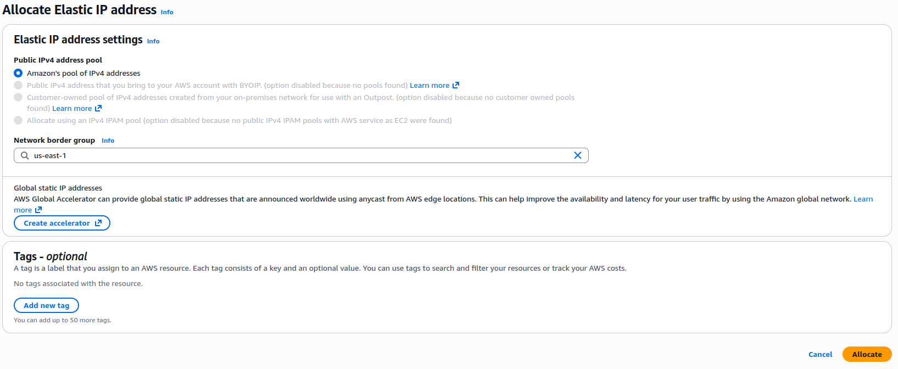
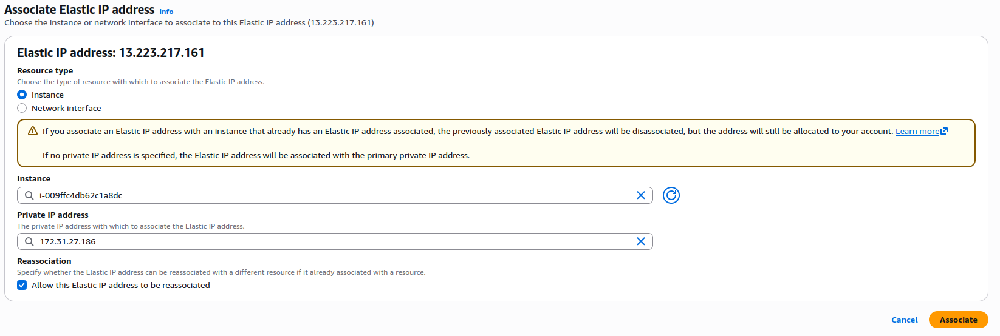

## PASO 1. Hacemos Clic en AWS (Cuando el laboratorio esté encendido)

## PASO 2. Entramos en el apartado EC2

## PASO 3. En la barra lateral (después de hacer clic en el circulito con las 3 líneas) encuentra el apartado de ip elásticas

## PASO 4. Selecciona Asignar ip elástica

## PASO 4. Selecciona Amazon’s pool of IPv4 addresses

## PASO 5. Para asignar la ip elastica a la EC2, selecciona acciones > Asociar IP elastica

## PASO 6. Selecciona la id de la EC2, asigna IP privada y dale a asociar

