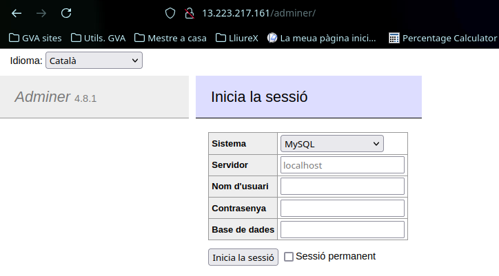
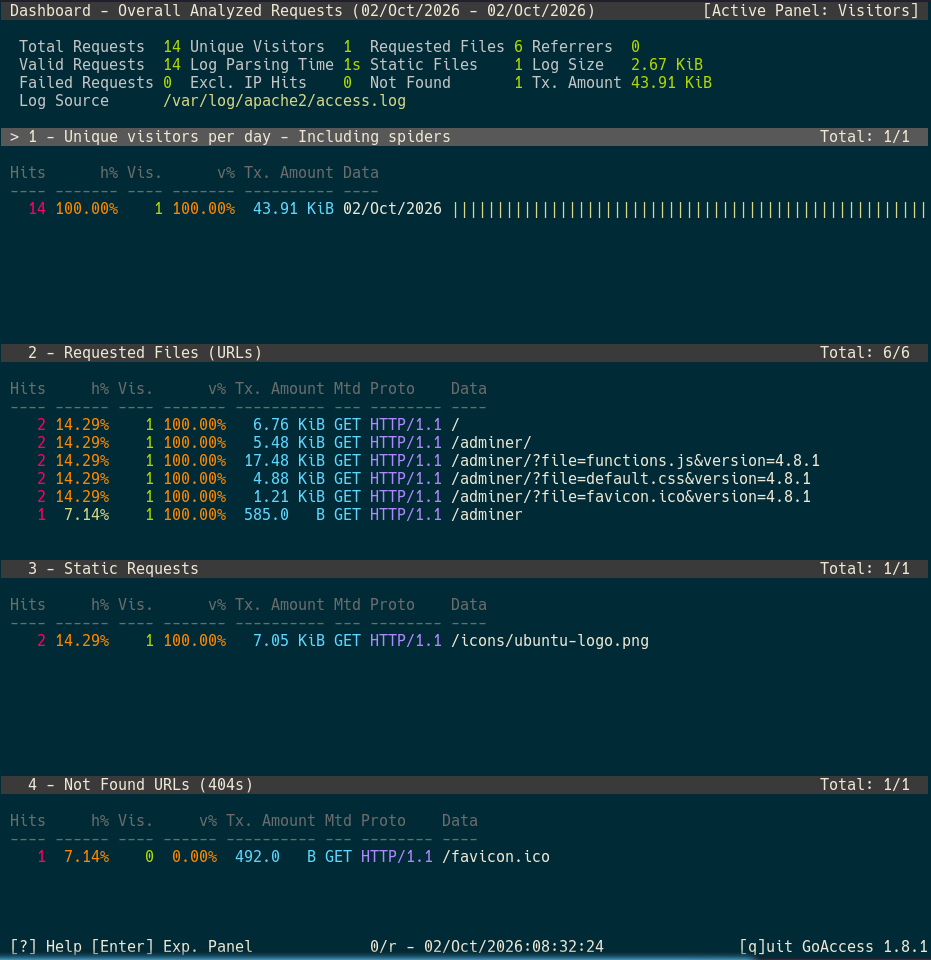

ADMINER FUNCIONANDO

sudo apt install adminer

sudo a2enconf adminer (PARA HABILITAR LA CONFIGURACIÓN)
sudo systemctl restart apache2

http://13.223.217.161/adminer/

GOACCESS FUNCIONANDO

sudo apt install goaccess
sudo goaccess /var/log/apache2/access.log --log-format=COMBINED -a

